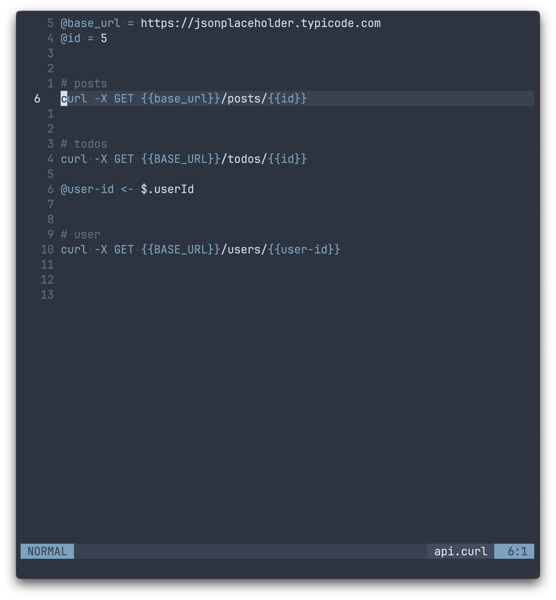
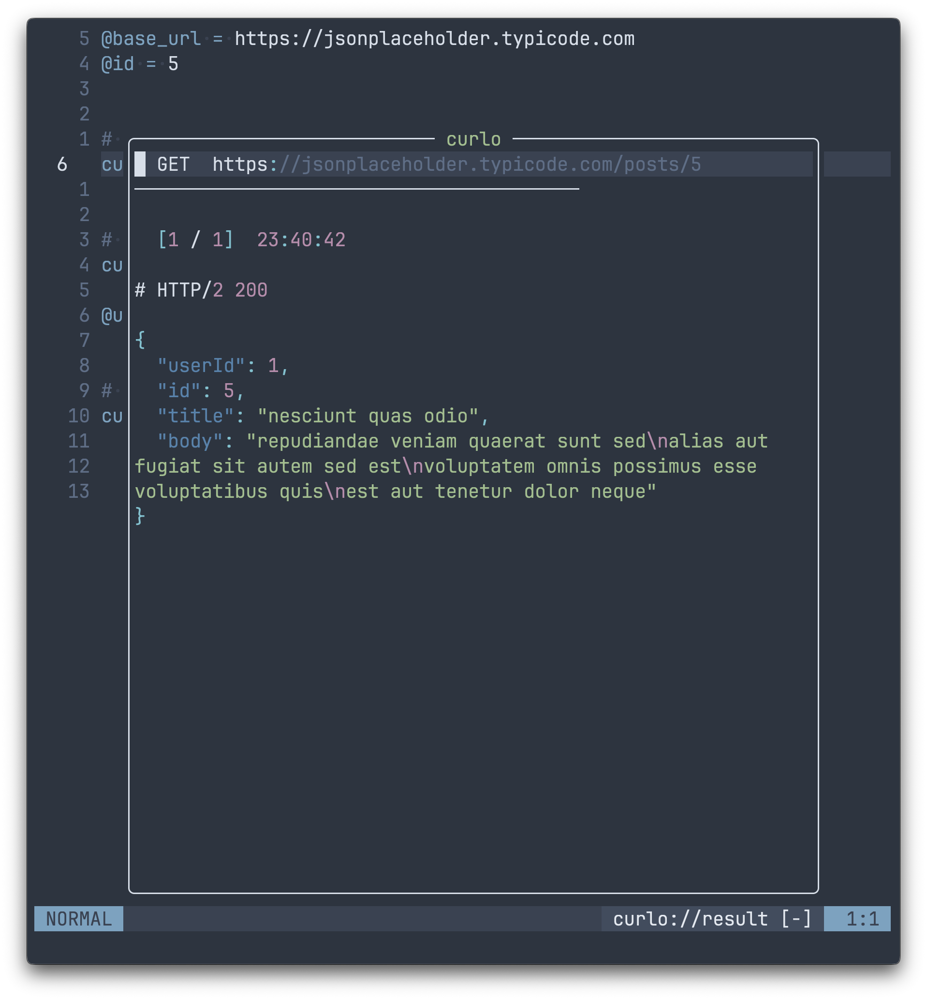

# curlo.nvim

<div style="display: flex; gap: 10px;">
  
  
</div>

A Neovim plugin for writing and executing curl requests directly from the editor.

## Requirements

- Neovim ≥ 0.9
- `curl` on `$PATH`
- Optional: `jq` or `python3` for JSON formatting, `xmllint` for XML formatting

## Installation

**lazy.nvim**

```lua
{
  "14096/curlo.nvim",
  ft = "curl",
  config = function()
    require("curlo").setup()
  end,
}
```

## Configuration

Default configuration:

```lua
require("curlo").setup({
  -- keymap applied in .curl buffers
  keymap      = "<leader>cc",
  keymap_opts = { noremap = true, silent = true, desc = "Run curl under cursor" },

  -- result window mode: "vsplit" | "split" | "float" | "tab"
  display          = "vsplit",
  result_win_width  = 80,   -- columns, used by "vsplit"
  result_win_height = 20,   -- rows,    used by "split"

  -- floating window options (used when display = "float")
  float = {
    width  = 0.6,        -- fraction of editor width  (≤1.0) or absolute columns (>1.0)
    height = 0.8,        -- fraction of editor height (≤1.0) or absolute rows    (>1.0)
    border = "rounded",  -- any border accepted by nvim_open_win
    title  = " curlo ",  -- set to "" or nil to disable
  },

  -- response formatting
  show_headers = false,  -- show full response headers by default
  format_json  = true,
  format_xml   = true,
})
```

## Variables

### local variables

Define variables anywhere in your `.curl` file using `@name = value`.
Reference them in requests with `{{name}}` (lookup is case-insensitive).

```
@base_url = https://api.example.com
@token    = my-secret-token

curl {{base_url}}/users
  -H "Authorization: Bearer {{token}}"
  -H "Accept: application/json"

curl -X DELETE {{base_url}}/users/42
  -H "Authorization: Bearer {{token}}"
```

### Environment variables

Place a `.env` file in the same directory as the `.curl` file:

```sh
# .env
BASE_URL=https://api.example.com
TOKEN=my-secret-token
```

Then reference with the same `{{NAME}}` syntax:

```
curl {{BASE_URL}}/users
  -H "Authorization: Bearer {{TOKEN}}"
```

## Captures

Extract values from a JSON response and store them as runtime variables, available to all subsequent requests in the same session.

Write capture directives after a request block (separated by a blank line):

```
# Step 1: obtain an access token
curl -X POST https://auth.example.com/oauth/token
  -H "Content-Type: application/x-www-form-urlencoded"
  -d "grant_type=client_credentials&client_id=myapp&client_secret=secret"

@access_token <- $.access_token
@expires_in   <- $.expires_in

# Step 2: use the captured token
curl https://api.example.com/users
  -H "Authorization: Bearer {{access_token}}"
  -H "Accept: application/json"
```

### Syntax

```
@var_name <- $.json.path
```

| Example                         | Extracts      |
| ------------------------------- | ------------- |
| `@token <- $.access_token`      | Top-level key |
| `@city  <- $.user.address.city` | Nested path   |
| `@first <- $.items[0].name`     | Array element |

### Resolution priority

Runtime captures have the **highest** priority in variable resolution:

```
captured runtime vars  (set by @var <- $.path directives)
      ↓
@name = value  (file-local definitions)
      ↓
.env file
      ↓
$PROCESS_ENV
```

Captured values persist for the entire session. Running a request again overwrites the previous captured values. Use `:CurloReset` to clear all captured variables.

## Output redirection

Append `>> path` on its own line immediately after a request block to write the formatted response body to a file.

```
curl https://api.example.com/users/1
>> ~/responses/user.json
```

## Commands

| Command         | Description                             |
| --------------- | --------------------------------------- |
| `:CurloRun`     | Run the curl request under the cursor   |
| `:CurloRunAll`  | Run all requests in the current buffer  |
| `:CurloHistory` | Browse the session history of responses |
| `:CurloReset`   | Clear all captured variables            |

## Similar Plugins

- [kulala.nvim](https://github.com/mistweaverco/kulala.nvim)
- [curl.nvim](https://github.com/oysandvik94/curl.nvim)
- [rest.nvim](https://github.com/rest-nvim/rest.nvim)
